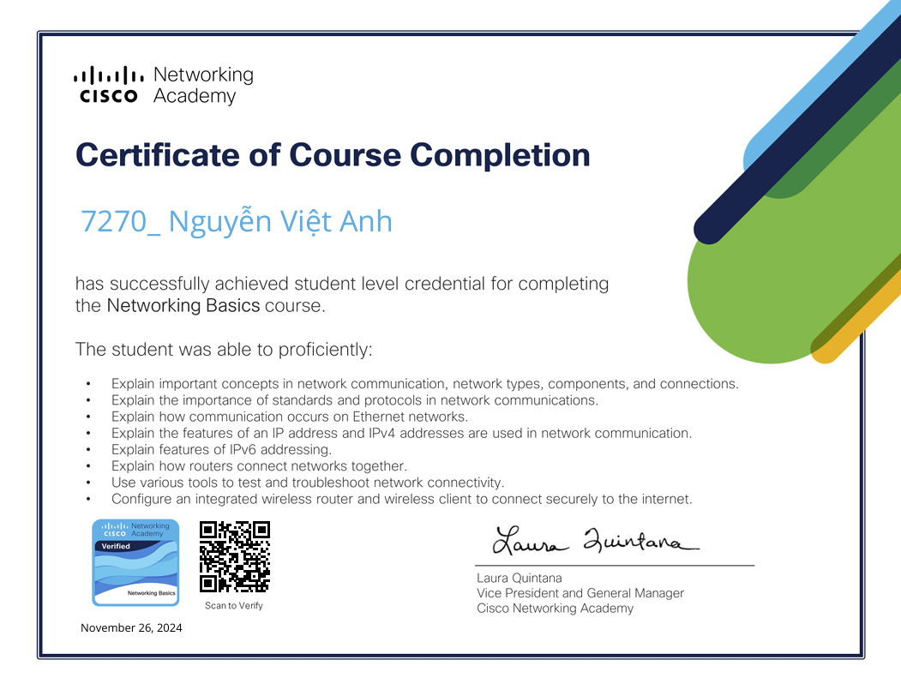
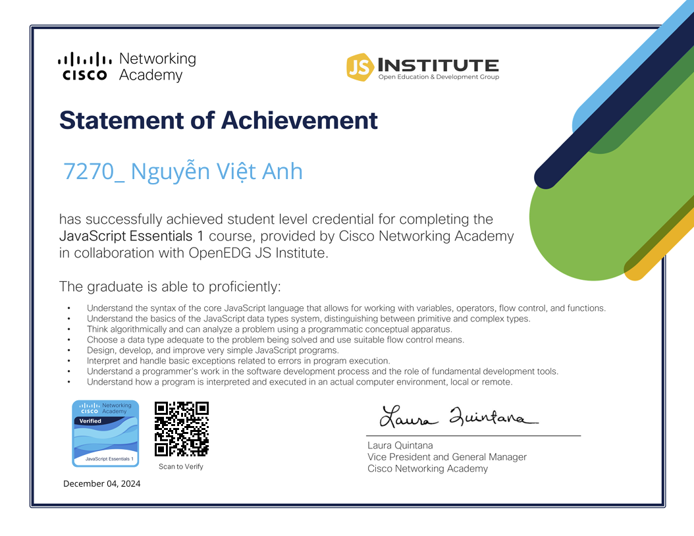

# 👋 Chào bạn, tôi là **Nguyễn Việt Anh**

---

## 📚 Thông tin về tôi
Tôi hiện tại là sinh viên năm 4 ngành Công Nghệ Thông Tin , chuyên ngành Công Nghệ Phần Mềm .Tôi luôn tìm kiếm cơ hội để hợp tác trong các dự án thú vị và học hỏi thêm về các công nghệ mới. Nếu bạn có ý tưởng nào hoặc cần hỗ trợ về phát triển phần mềm, đừng ngần ngại liên hệ với tôi!

---

## 📬 Liên hệ với tôi
Nếu bạn muốn kết nối hoặc có bất kỳ câu hỏi nào, đừng ngần ngại liên hệ với tôi qua email:

📧 **Email:** [nguyenvietanh08022003@gmail.com](mailto:nguyenvietanh08022003@gmail.com)

---

## 🌍 Mạng xã hội
Bạn có thể tìm thấy tôi ở các nền tảng sau:

- 🌐 [Facebook](https://www.facebook.com/profile.php?id=100011770384069)  
- 💻 [GitHub](https://github.com/7270-NguyenVietAnh)  

---
## 👨‍💻 Kỹ năng lập trình của tôi
| Kỹ năng          | Mức độ       |
|-------------------|--------------|
| Java             | ⭐⭐⭐          |
| C#               | ⭐⭐⭐⭐         |
| JavaScript       | ⭐⭐           |
| HTML             | ⭐⭐           |
| C                | ⭐⭐           |
| C++              | ⭐⭐           |
| Markdown         | ⭐            |
---

## 🎓 Chứng chỉ
Dưới đây là chứng chỉ của tôi:

### 🌐 Network Basic Badge

### 🌐 JavaScript Essentials 1 Badge
 

### 🌐 JavaScript Essentials 2 Badge

---

🌱 **Cảm ơn bạn đã ghé thăm trang của tôi!**
