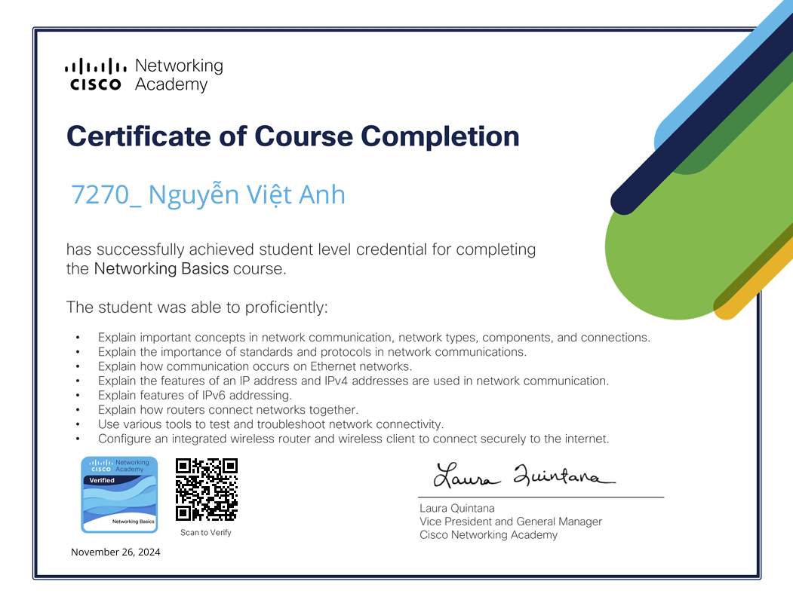
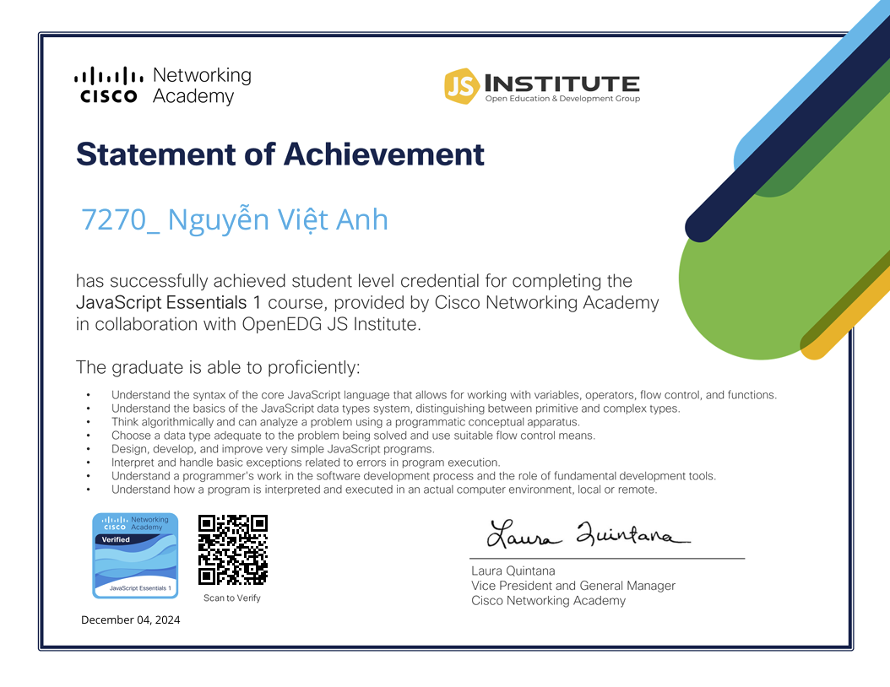
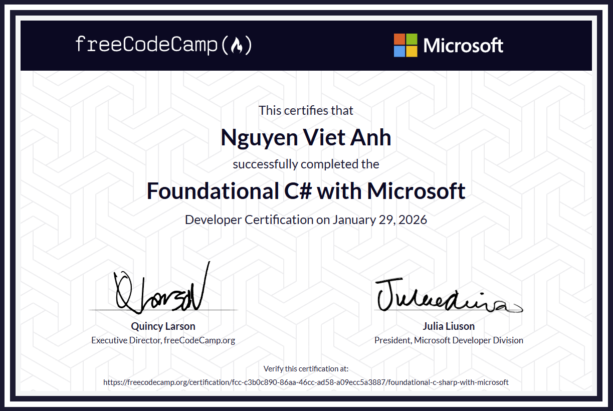

# 👋 Hi, I’m **Nguyen Viet Anh**

---

## 📚 About Me

I am a Software Engineering graduate with a Bachelor’s degree in Information Technology (Good classification, GPA: 2.92/4).

I am passionate about backend development, especially using C# and .NET technologies.  
I am currently seeking **Internship or Fresher Backend Developer (C#/.NET)** opportunities where I can apply my knowledge, gain real-world experience, and grow as a software engineer.

---

## 🎓 Education

**Bachelor of Software Engineering**  
Information Technology  
GPA: **2.92 / 4.0 (Good classification)**

---

## 📬 Contact

Feel free to reach out if you would like to connect or collaborate:

📧 **Email:** [nguyenvietanh08022003@gmail.com](mailto:nguyenvietanh08022003@gmail.com)

---

## 🌍 Social Links

- 🌐 [Facebook](https://www.facebook.com/profile.php?id=100011770384069)  
- 💻 [GitHub](https://github.com/7270-NguyenVietAnh)  

---

## 👨‍💻 Technical Skills

| Skill        | Level |
|-------------|-------|
| C# (.NET)   | ⭐⭐⭐⭐ |
| Java        | ⭐⭐⭐ |
| JavaScript | ⭐⭐ |
| HTML/CSS   | ⭐⭐ |
| C           | ⭐⭐ |
| C++         | ⭐⭐ |
| Markdown    | ⭐ |

---

## 🎯 Career Objective

To become a professional Backend Developer specializing in **C#/.NET**, focusing on building scalable APIs and backend systems while continuously improving my skills in databases, software architecture, and clean code practices.

---

## 💼 Professional Experience

### Backend Developer Intern  
**Global Insurance Corporation (GIC)**  
*April 21, 2025 – June 16, 2025*

- Gained hands-on experience with C# programming and applied theoretical knowledge to real backend systems.
- Debugged and fixed system issues using logging and debugging tools.
- Learned and understood the business workflow of property insurance systems, including policy issuance, claims processing, and reinsurance.
- Worked with core business modules such as SP, Policy Administration, and Claim Management.
- Developed problem-solving skills by analyzing logs, checking data consistency, and proposing solutions.
- Used internal project management and reporting tools, including dashboards and contract printing systems.

---

### Backend Developer Fresher  
**Global Insurance Corporation (GIC)**  
*August 25, 2025 – January 30, 2026*

- Enhanced understanding of company systems and insurance products to better support business requirements.
- Implemented new features and system enhancements based on internal specifications.
- Collaborated closely with team members and had direct interaction with customers.
- Completed assigned tasks on time while following team development processes and coding standards.

---

## 🎓 Certifications

<!-- ### 🌐 Network Basics Badge  

### 🌐 JavaScript Essentials 1  

### 🌐 JavaScript Essentials 2  
 -->

### 🌐 Foundational C# with Microsoft  

---

🌱 **Thank you for visiting my portfolio!**
